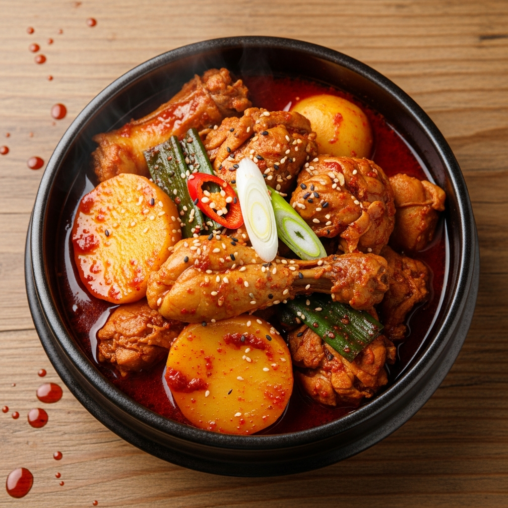
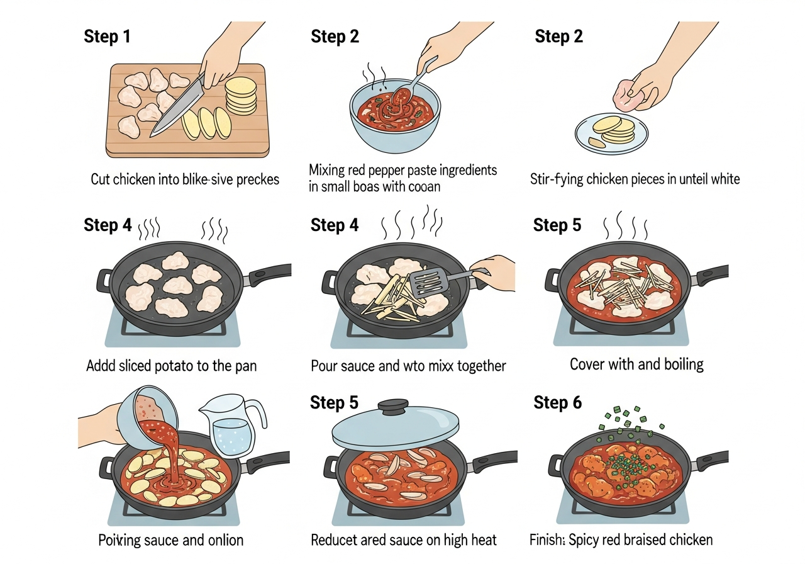

# 초간단 닭볶음탕 (15분 완성)

> ⏱️ 조리시간: 15분 | 🍽️ 1인분 | 난이도: ⭐ 쉬움

## 📝 재료
- 닭 안심 또는 닭 가슴살 — 200g (작게 썰어 판매하는 것 사용)
- 감자 — 1개 (작은 것, 얇게 슬라이스)
- 대파 — 1/2대
- 고추장 — 1.5 큰술
- 간장 — 1 큰술
- 설탕 — 1 큰술
- 다진 마늘 — 1 작은술 (없으면 생략 가능)
- 물 — 1/2컵 (100ml)
- 식용유 — 1 큰술
- 후추 — 약간

## 👨‍🍳 만드는 법
1. 닭 안심(또는 가슴살)을 한 입 크기로 썰어 준비합니다. 감자는 얇게 (0.5cm 이하) 슬라이스하고, 대파는 어슷하게 썹니다.
2. 볼에 고추장 1.5 큰술, 간장 1 큰술, 설탕 1 큰술, 다진 마늘 1 작은술, 후추 약간을 섞어 양념장을 미리 만들어 둡니다.
3. 팬에 식용유를 두르고 중강불로 달군 뒤 닭고기를 넣어 겉면이 하얗게 변할 때까지 2~3분 볶습니다.
4. 얇게 썬 감자를 넣고 30초 정도 함께 볶아줍니다.
5. 양념장과 물 1/2컵을 넣고 잘 섞은 뒤 뚜껑을 덮고 중불에서 7~8분 끓입니다. (감자가 얇아서 금방 익어요!)
6. 뚜껑을 열고 대파를 넣은 뒤 강불로 올려 1~2분 더 조려 국물을 살짝 걸쭉하게 만들면 완성입니다.

## 🎬 단계별 요리 과정

## 💡 꿀팁
- 닭 안심이나 닭 가슴살을 사용하면 뼈 없이 조리가 훨씬 빠릅니다. 마트에서 손질된 제품을 구매하면 더욱 편리해요!
- 감자를 얇게 썰수록 빨리 익습니다. 두껍게 썰면 10분 이상 걸릴 수 있으니 최대한 얇게 썰어 주세요.
- 양념장은 미리 만들어 두면 나중에 한꺼번에 부을 수 있어서 시간을 절약할 수 있어요.
- 설거지 최소화 팁: 양념 재료를 계량할 때 팬에 바로 넣거나, 작은 그릇 하나에 모든 양념을 섞어 두세요. 팬 하나로 완성되는 요리입니다!
- 당근, 양파, 떡 등 냉장고에 있는 재료를 추가해도 잘 어울려요.
- 더 매콤하게 먹고 싶다면 고추장을 0.5 큰술 더 추가하거나 청양고추를 넣어보세요.
