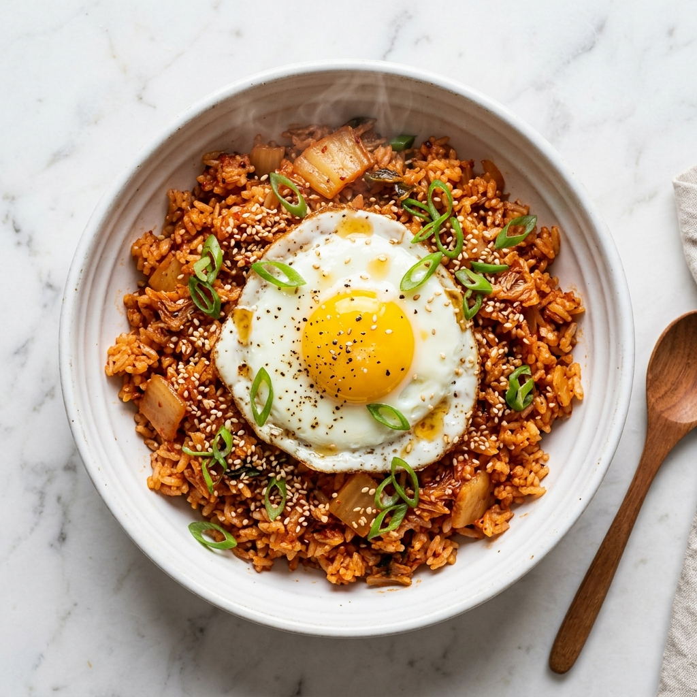
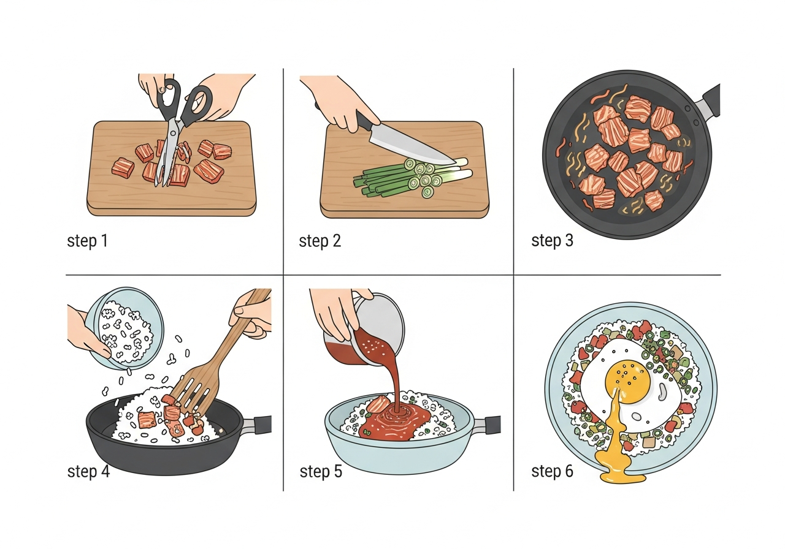

# 김치볶음밥 / Kimchi Fried Rice

> 잘 익은 신김치와 밥을 볶아 만드는 한국의 대표적인 볶음밥 요리. 간단하면서도 깊은 맛을 내는 한 그릇 요리로, 남은 밥과 김치를 활용하기에 최적입니다.

## 📋 기본 정보 (Basic Info)

| 항목       | 내용       |
|------------|------------|
| 준비 시간  | 10분       |
| 조리 시간  | 10분       |
| 총 시간    | 20분       |
| 인분       | 2인분      |
| 난이도     | 쉬움       |

## 🛒 재료 (Ingredients)

### 주재료
- [ ] 밥 - 2공기 (약 400g, 찬밥 권장)
- [ ] 신김치 (배추김치) - 1컵 (약 150g)
- [ ] 김치 국물 - 2큰술
- [ ] 대파 - 1대
- [ ] 달걀 - 2개
- [ ] 식용유 - 2큰술

### 양념
- [ ] 고추장 - 1/2큰술 (선택)
- [ ] 참기름 - 1큰술
- [ ] 설탕 - 1/2작은술
- [ ] 간장 - 1작은술 (간 조절용)

### 추가 재료 (선택)
- [ ] 돼지고기 (삼겹살 또는 앞다리살) - 100g
- [ ] 스팸 또는 햄 - 50g
- [ ] 김 가루 - 적당량
- [ ] 깨 - 적당량
- [ ] 쪽파 - 약간 (고명용)

## 👨‍🍳 조리 방법 (Instructions)

### 준비 단계
1. 신김치는 가위로 잘게 잘라준다. 김치 국물은 따로 2큰술 정도 덜어둔다.
2. 대파는 송송 썰어준다.
3. 돼지고기를 사용할 경우 작게 한 입 크기로 썰어둔다.
4. 찬밥이 뭉쳐 있으면 미리 살짝 풀어둔다.

### 조리 단계
1. 팬에 식용유 1큰술을 두르고 중강불로 달군다.
2. (고기를 사용할 경우) 돼지고기를 먼저 넣고 겉면이 노릇해질 때까지 약 2~3분간 볶는다.
3. 잘게 자른 김치를 넣고 중불에서 약 2~3분간 볶아 수분을 날려준다. 김치가 살짝 캐러멜화되면서 단맛이 올라온다.
4. 설탕 1/2작은술을 넣고 30초 정도 더 볶아 김치의 단맛을 끌어올린다.
5. 밥을 넣고 주걱으로 김치와 고루 섞이도록 볶는다. 밥알이 하나하나 분리되도록 꾹꾹 눌러가며 볶아준다.
6. 김치 국물 2큰술과 고추장(선택)을 넣고 골고루 섞이도록 약 2분간 볶는다.
7. 간장으로 간을 보고, 대파를 넣어 30초간 살짝 더 볶는다.
8. 불을 끄고 참기름 1큰술을 둘러 섞어준다.

### 마무리
1. 별도의 팬에 식용유를 약간 두르고 달걀 프라이를 만든다. 반숙 또는 완숙은 취향에 따라 조절한다.
2. 볶음밥을 그릇에 담고 달걀 프라이를 올린다.
3. 김 가루, 깨, 쪽파 등을 고명으로 뿌려 완성한다.

## 🎬 단계별 요리 과정

## 💡 팁 & 변형 (Tips & Variations)

- **찬밥을 사용하세요**: 갓 지은 밥보다 냉장고에서 하루 정도 둔 찬밥이 수분이 적어 볶음밥에 훨씬 적합합니다. 밥알이 잘 분리되어 파라파라한 식감을 낼 수 있습니다.
- **신김치가 핵심**: 최소 2~3주 이상 숙성된 신김치를 사용해야 깊은 맛이 납니다. 덜 익은 김치는 볶음밥 특유의 감칠맛이 부족합니다.
- **센 불 유지**: 볶는 동안 불이 약하면 밥이 눅눅해집니다. 중강불 이상을 유지하면서 빠르게 볶아야 합니다.
- **참기름은 마지막에**: 참기름은 열에 약하므로 불을 끈 후 넣어야 향이 살아납니다.
- **매운맛 조절**: 고추장 양을 늘리거나, 청양고추를 추가하면 매운맛을 높일 수 있습니다.
- **치즈 변형**: 마지막에 모짜렐라 치즈를 올리고 뚜껑을 덮어 녹이면 치즈 김치볶음밥이 됩니다.
- **볶음밥 도시락**: 한 김 식힌 후 김으로 감싸 주먹밥 형태로 만들면 도시락으로도 좋습니다.

## 🔄 대체 재료 (Substitutions)

| 원래 재료      | 대체 재료                          |
|----------------|-------------------------------------|
| 돼지고기       | 참치캔, 새우, 닭가슴살, 두부       |
| 스팸/햄        | 소시지, 베이컨                      |
| 대파           | 쪽파, 양파                          |
| 고추장         | 고춧가루 1작은술 + 된장 약간        |
| 백미밥         | 잡곡밥, 현미밥 (조금 더 볶아야 함)  |
| 식용유         | 돼지기름 (라드) - 더 고소한 맛      |
| 달걀 프라이    | 스크램블 에그, 삶은 달걀            |

## 📊 영양 정보 (Nutrition, per serving)

| 영양소   | 함량        |
|----------|-------------|
| 칼로리   | 약 450 kcal |
| 단백질   | 14g         |
| 탄수화물 | 65g         |
| 지방     | 15g         |
| 나트륨   | 800mg       |
| 식이섬유 | 3g          |

*위 영양 정보는 기본 재료(밥, 김치, 달걀, 양념) 기준 1인분 추정치입니다. 돼지고기, 스팸 등 추가 재료에 따라 달라질 수 있습니다.*

## 🏷️ 태그

`한식` `볶음밥` `김치` `한그릇요리` `간편식` `야식` `남은밥활용` `초보요리`

---
*출처: 한국 가정식 전통 레시피 종합 | 저장일: 2026-03-23*
