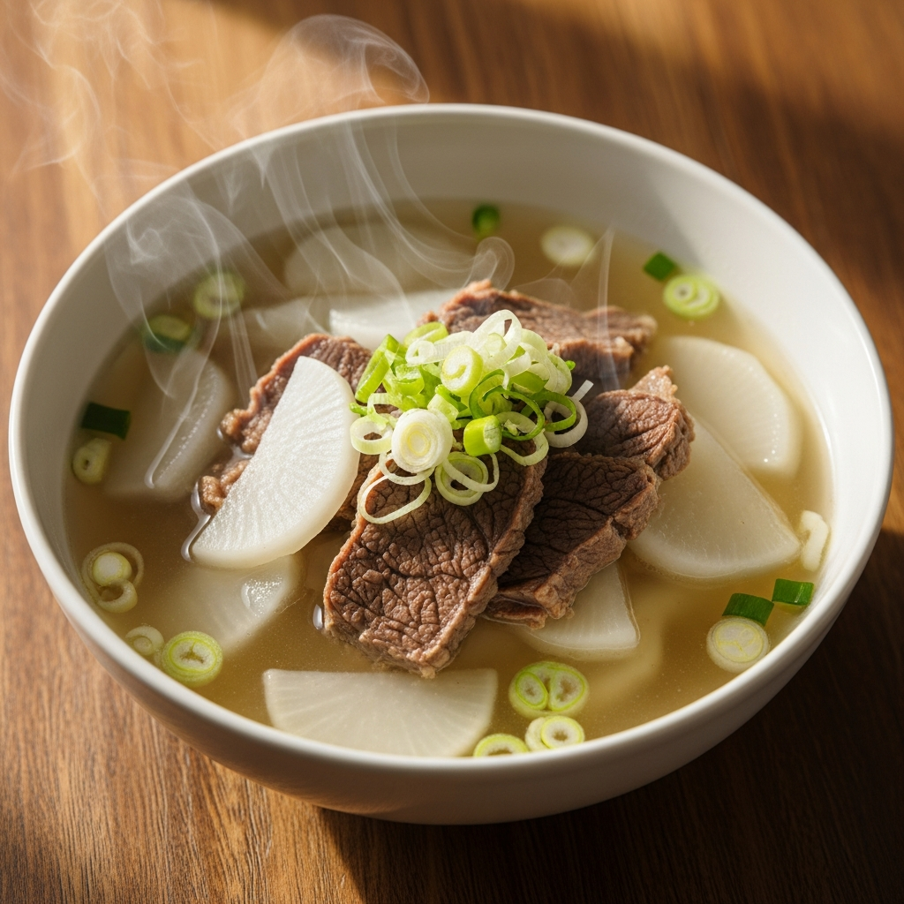
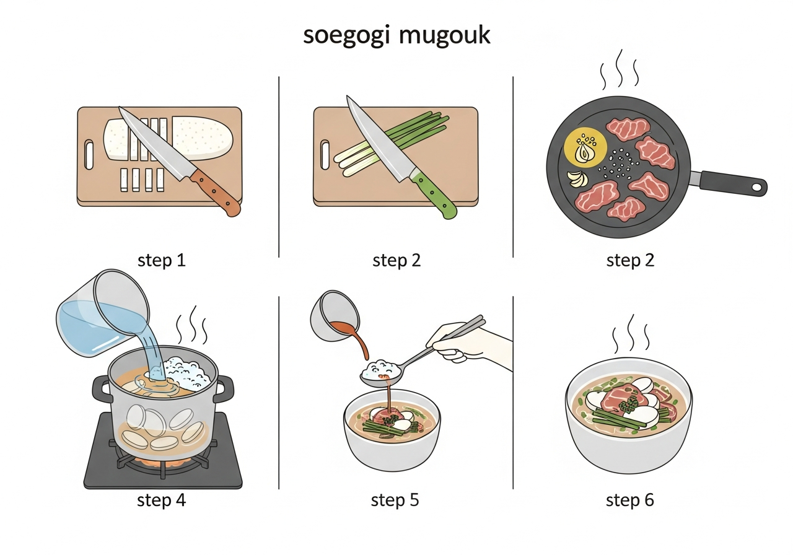

# 소고기 무국

> ⏱️ 조리시간: 15분 | 🍽️ 1인분 | 난이도: ⭐ 쉬움

## 📝 재료
- 불고기용 소고기 (얇게 썬 것) — 100g
- 무 — 200g (약 5cm 두께)
- 대파 — 1/4대
- 국간장 — 1큰술
- 참기름 — 1/2작은술
- 다진 마늘 — 1/2작은술
- 물 — 500ml
- 소금 — 약간
- 후추 — 약간

## 👨‍🍳 만드는 법
1. 무는 껍질을 벗기고 최대한 얇게 (2~3mm) 나박썰기 하세요. 얇을수록 빨리 익어요!
2. 대파는 어슷하게 썰어 준비해요.
3. 냄비에 참기름을 두르고 중불에서 소고기와 다진 마늘을 30초간 볶아요. 소고기 색이 변하면 OK!
4. 물 500ml를 붓고 무를 넣은 뒤 강불로 끓여요.
5. 끓어오르면 거품을 걷어내고, 국간장으로 간을 맞춰요.
6. 무가 투명하게 익으면 (약 7~8분) 대파를 넣고 소금, 후추로 최종 간을 맞춰요.
7. 1~2분 더 끓이면 완성! 따뜻하게 바로 드세요.

## 🎬 단계별 요리 과정

## 💡 꿀팁
- 무를 최대한 얇게 썰수록 15분 안에 충분히 익어요. 두껍게 썰면 시간이 더 걸려요!
- 전자레인지 활용: 썰은 무를 그릇에 담고 물 2큰술 + 뚜껑 씌워 3분 돌리면 반쯤 익혀져서 조리 시간이 훨씬 단축돼요.
- 소고기는 불고기용 얇은 것을 사용하면 금방 익어서 편해요. 없으면 햄이나 참치캔으로도 맛있어요!
- 냄비 하나만 쓰면 설거지 끝! 재료도 간단해서 부담 없어요.
- 국간장이 없으면 일반 간장 + 소금으로 대체 가능해요.
- 남은 국은 밥을 말아 먹으면 더 맛있어요.
